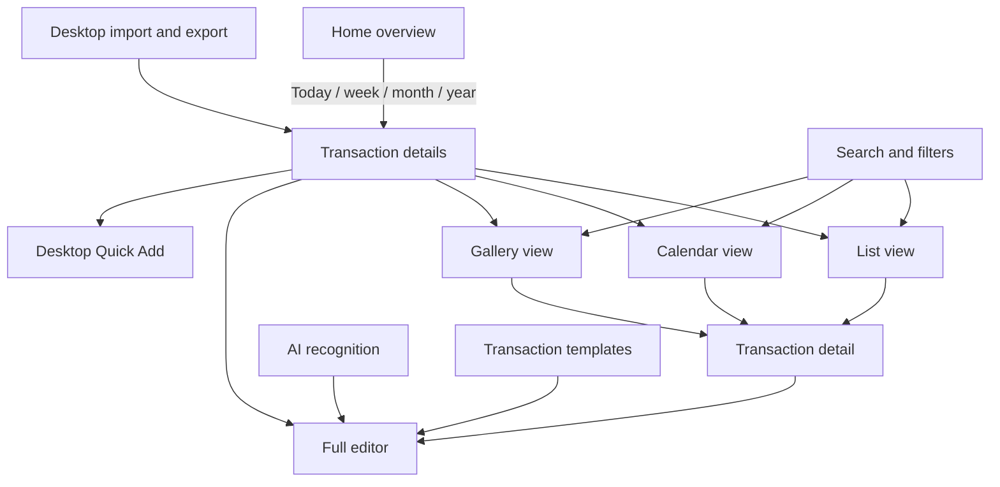
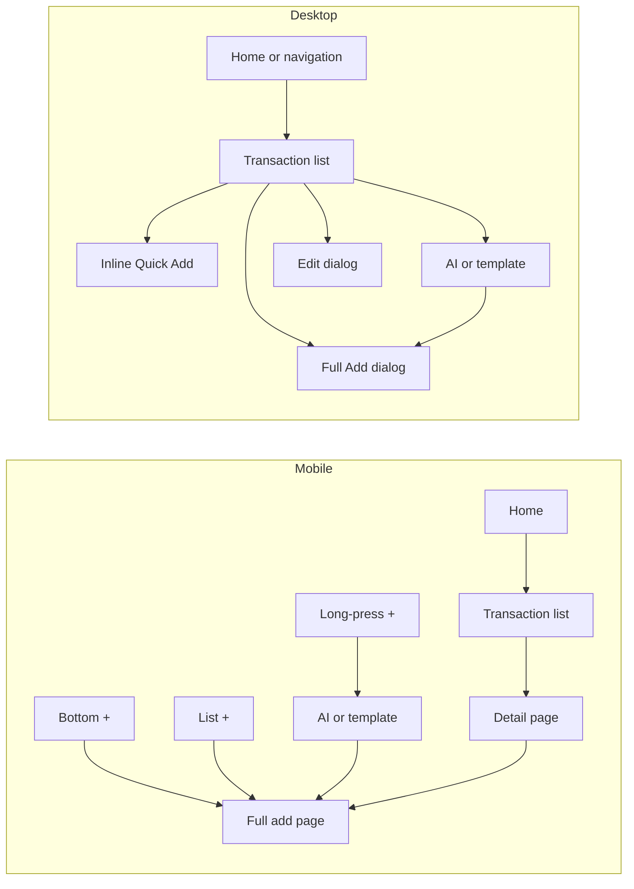
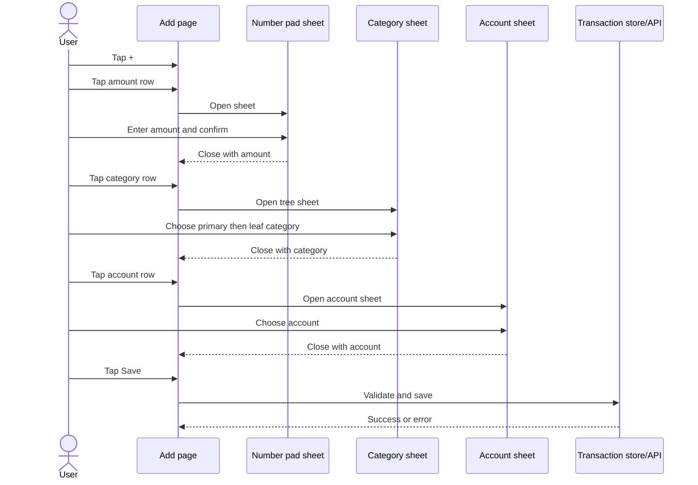
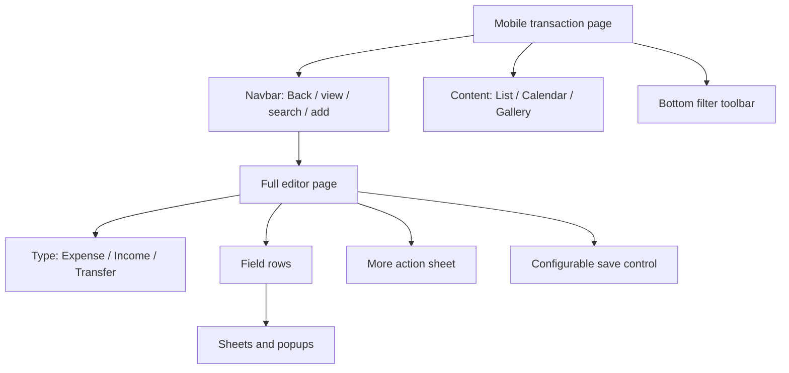
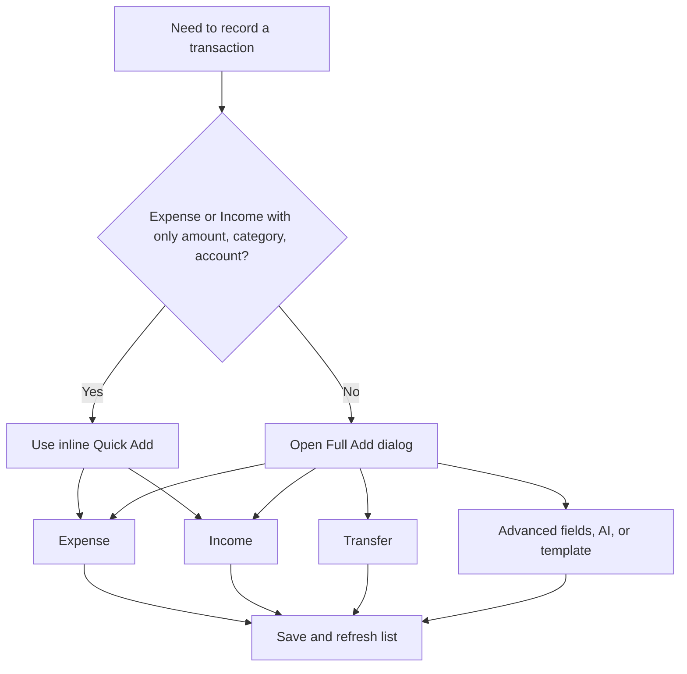
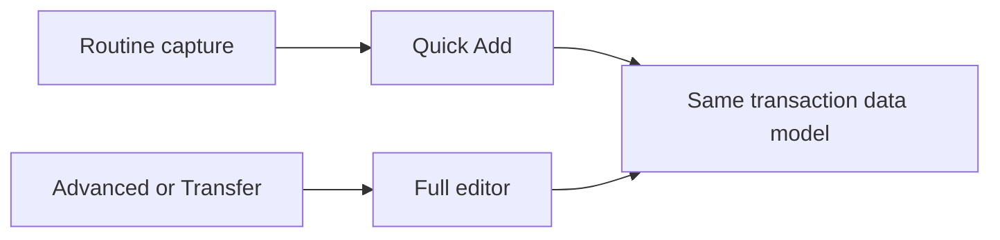

# Transaction UI/UX — Current State

**Observed:** 2026-08-05
**Scope:** Current transaction experience on mobile and desktop. This is an inventory, not a redesign proposal.

## 1. What exists now

| Capability | Mobile | Desktop |
|---|---|---|
| Transaction types | Expense, Income, Transfer; Modify Balance where applicable | Expense, Income, Transfer; Modify Balance where applicable |
| Quick Add | Not implemented | Inline Expense/Income row above the transaction table |
| Full editor | Full-page editor | Modal dialog |
| Views | List, Calendar, Gallery | List, Calendar, Gallery |
| Search | Description search | Description search |
| Filters | Date, type, category, amount, account, tags | Date/time, category, amount, account, tags |
| Add from active filters | Prefills a single selected type/category/account/tag and relevant date | Full Add dialog uses the current page context |
| Row actions | Open detail; swipe to Duplicate, Edit, Delete | Open Edit dialog and use dialog actions |
| AI entry | Clipboard text and image recognition | Clipboard text and image recognition |
| Templates | Add from normal transaction templates | Add from normal transaction templates |
| Pictures | Gallery view; add/view/remove in full editor | Gallery view; add/view/remove in full editor |
| Import/export | Not exposed on this mobile list page | Import; export CSV or TSV |
| Refresh/loading | Pull to refresh, infinite scroll, Load More | Refresh button and pagination |

Transfer remains part of the product. It is available in the full editor, list filters, transaction display, duplication, templates, imports/exports, reports, and backend services. Desktop Quick Add intentionally handles only Expense and Income.

## 2. Current information architecture

## 3. Entry points

### Mobile

- Home overview rows open the transaction list filtered to Today, This Week, This Month, or This Year.
- The center `+` in the bottom navigation opens the full Add Transaction page.
- Long-pressing the center `+` opens AI clipboard recognition, AI image recognition, and transaction templates.
- The `+` in the transaction-list navbar opens the full editor and carries forward compatible active filters.
- Tapping a transaction opens its detail page; swiping exposes Duplicate, Edit, and Delete.

### Desktop

- Home overview links open Transaction Details with a date range.
- Transaction Details is also available in the main navigation.
- The list page exposes an Add button, AI recognition, templates, import/export, refresh, and search.
- The inline Quick Add row sits above the transaction table.
- Clicking an existing row opens the full Edit dialog.

## 4. Mobile UI/UX now

### Transaction list

- The navbar contains Back, the current view selector, Search, and Add.
- A fixed bottom toolbar contains previous range, current date range, next range, Category, Account, and More.
- More contains transaction type, amount, and tag filters.
- List mode groups transactions by month. Each group can collapse and can show monthly Income and Expense totals.
- Each row shows date, category/icon, amount, optional description, tags, time/timezone, and account. Transfers show source account to destination account.
- Calendar mode shows daily totals and the transactions on the selected date.
- Gallery mode shows transaction pictures grouped by month.
- Loading uses skeletons; the page supports pull-to-refresh and incremental loading.

### Full add/edit page

The page first chooses Expense, Income, or Transfer. Most field rows open a separate sheet or popup:

- source amount: number-pad sheet;
- destination amount: number-pad sheet for Transfer;
- category: two-level category selection sheet;
- source and destination accounts: account selection sheets;
- date/time: date-time sheet;
- timezone: timezone popup;
- location: action sheet and map sheet;
- tags: tag selection sheet;
- pictures: camera/file input and photo browser;
- description: text field on the page.

The More action sheet also provides available AI recognition, clipboard amount actions, Transfer swap actions, show/hide amount, picture actions, and duplication variants. Save can be the navbar checkmark, a floating quick-save button, or a fixed bottom button depending on settings. Quick-save behavior can be Save and go back, Save and add another, or Save and keep current data.

### Mobile interaction shape

For the basic “add an expense from scratch” reference path above, the existing design document counts 12 taps: open Add, open amount, enter three digits, confirm, open category, choose primary and leaf category, open account, choose account, and save. It includes four page/sheet transitions. Actual taps vary with the amount length, defaults, active filters, templates, and quick-save settings.

### Mobile screen hierarchy

## 5. Desktop UI/UX now

### Transaction list

- A left-side control area switches List, Calendar, and Gallery, selects page size, and selects date ranges.
- The main toolbar contains Add, Import/Export, Refresh, and description search.
- Table headers expose filters for time/date, category, amount, account, and tags, including multi-select dialogs.
- The table shows time, category, amount, account, tags, and description. Transfers show source and destination accounts.
- Calendar mode provides daily totals; Gallery mode shows transaction pictures.

### Inline Quick Add

Quick Add is a single horizontal row with:

1. Spend/Earn toggle;
2. amount input;
3. filterable two-column leaf-category selector;
4. filterable two-column account selector;
5. Save button.

It defaults category and account from recent use where possible. Enter saves, Escape resets, successful save resets the row and refreshes the list, and errors appear through the page snackbar. Amounts stay in the domain's integer-hundredths representation; the component does not rescale them.

Quick Add does not expose Transfer, date/time, timezone, tags, description, location, pictures, AI recognition, or templates. Those remain in Full Add.

### Full add/edit dialog

The dialog keeps the major fields together in one desktop modal: type, source/destination amounts, category, source/destination accounts, date/time, timezone, location, tags, description, and pictures. It also provides AI recognition and Transfer-specific actions. Compared with mobile, desktop uses fewer full-screen transitions, but the modal contains substantially more controls than Quick Add.

### Desktop add decision flow

## 6. Current UX observations

These describe the current interface; they are not proposed solutions.

| Area | Current behavior | UX consequence |
|---|---|---|
| Mobile routine entry | Always enters the full editor | Common Expense/Income entry shares the same surface as advanced entry |
| Mobile field editing | Amount, category, account, date, tags, and location open separate surfaces | The user repeatedly changes context during one transaction |
| Mobile filters | Six controls share a compact bottom toolbar; additional filters live under More | Powerful filtering is available, but state is distributed across popovers and pages |
| Desktop routine entry | Quick Add stays in list context | Common Expense/Income entry is short and immediately visible |
| Desktop advanced entry | Full modal contains all transaction capabilities | Transfer and metadata are available without leaving the list, with higher visual density |
| Cross-device consistency | Desktop has Quick Add; mobile does not | The shortest entry path differs by device |
| Transfer | Available in Full Add/Edit and filters, absent from Quick Add | Routine entry stays focused while the complete model remains accessible |
| Category validity | Saving requires a leaf category | A primary category is navigation/grouping, not a valid final transaction category |

## 7. Boundary for the next design step

The current system already separates two jobs on desktop:

Mobile currently routes both jobs through the full editor. A later UX proposal can decide whether to introduce the same separation on mobile, improve the full editor itself, improve discovery and filters, or combine those changes. No such choice is made in this document.
